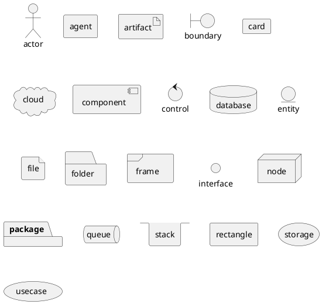
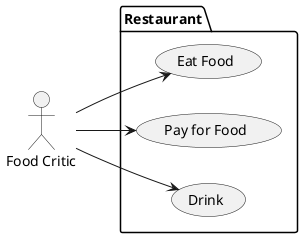
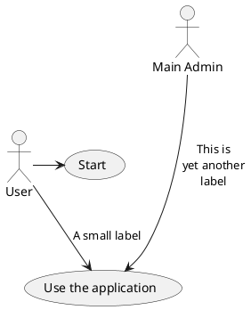
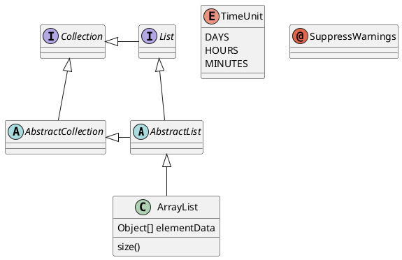

# Test pour mocodo
This is a test for mocodo extension on Markdig

```mocodo {colors=ocean image_format="svg" shapes=copperplate relations="html_verbose" }
DF, 11 Élève, 1N Classe
Classe: Num. classe, Num. salle
Faire Cours, 1N Classe, 1N Prof: Vol. horaire
Catégorie: Code catégorie, Nom catégorie

Élève: Num. élève, Nom élève
Noter, 1N Élève, 0N Prof, 0N Matière, 1N Date: Note
Prof: Num. prof, Nom prof
Relever, 0N Catégorie, 11 Prof

Date: Date
Matière: Libellé matière
Enseigner, 11 Prof, 1N Matière
```
This is a plantuml diagram


This is the end of plantuml diagram






